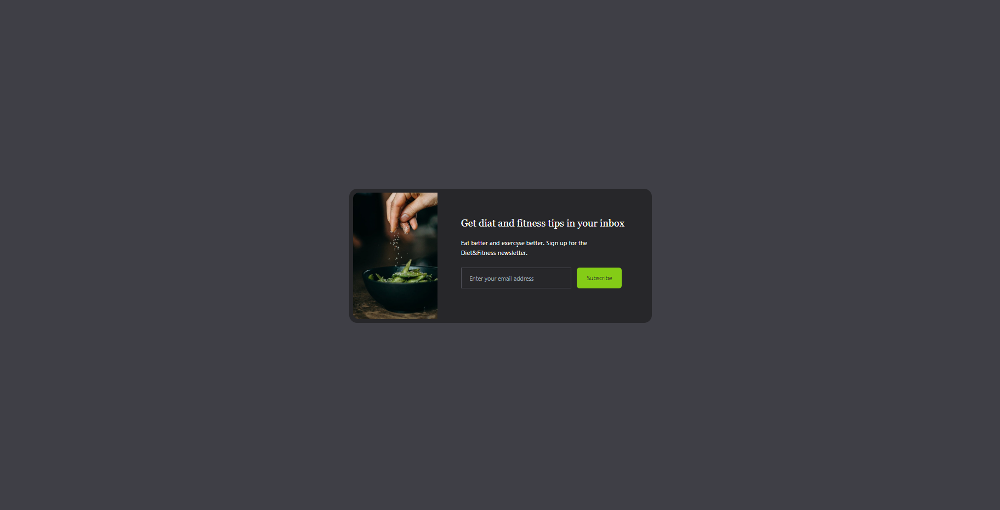
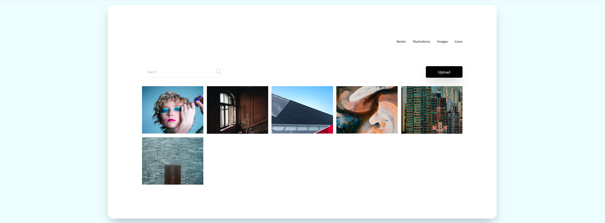
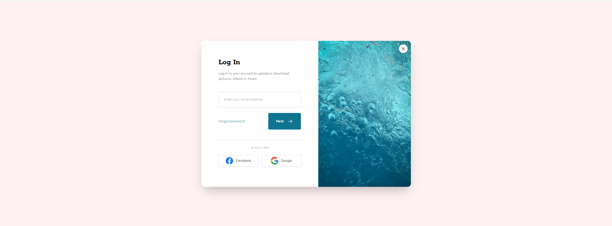

## 🎨 Tailwind CSS Mini Projects

This section showcases a collection of small, hands-on projects built with **Tailwind CSS**.  
Each mini project focuses on practicing the utility-first workflow and building responsive, modern interfaces.

---

### 1️⃣ Email Subscribe Card

A responsive email subscription component built with **Tailwind CSS**.

**Highlights**
- Mobile-first design with flexible layout (flex & responsive utilities)
- Smooth hover and transition effects
- Clean dark theme with a bright call-to-action button

📂 **Folder Path**  
`tailwind-projects/email-subscribe`

🖼 **Preview**  

  

---

### 2️⃣ Image Gallery

A responsive image gallery application built with **Tailwind CSS**.

**Highlights**
- Clean and minimal UI with a modern card layout
- Fully responsive grid (mobile to desktop)
- Hover effects revealing image details and bookmark icon
- Search bar and category menu with subtle hover animations

📂 **Folder Path**  
`tailwind-projects/image-gallery`

🖼 **Preview**  

  

---

### 3️⃣ Login Modal

A responsive login modal built with **Tailwind CSS**.

**Highlights**
- Clean, centered card layout with a split image panel
- Fully responsive design for mobile and desktop
- Smooth hover and transition effects on buttons
- Includes social login buttons (Facebook & Google)

📂 **Folder Path**  
`tailwind-projects/login-modal`

🖼 **Preview**  

  

---
### 4️⃣ Pricing Cards

A set of responsive pricing cards built with **Tailwind CSS**.

**Highlights**
- Clean dark theme with accent highlight on the featured plan
- Flexible, responsive layout (stack on mobile, row on desktop)
- Subtle shadows, borders, and hover transitions for interaction
- Semantic typography hierarchy for plan name, price, and features

📂 **Folder Path**  
`tailwind-projects/pricing-cards`

🖼 **Preview**  

  

---
### 5️⃣ Product Modal

A clean product detail / purchase card built with **Tailwind CSS**.

**Highlights**
- Split layout with product image and details
- Price block with crossed-out old price and bold sale price
- Primary CTA with pressed/raised button effect (border swap trick)
- Stock indicator with animated ping on hover
- Secondary actions: add to cart & add to wishlist

📂 **Folder Path**  
`tailwind-projects/product-modal`

🖼 **Preview**  

  

