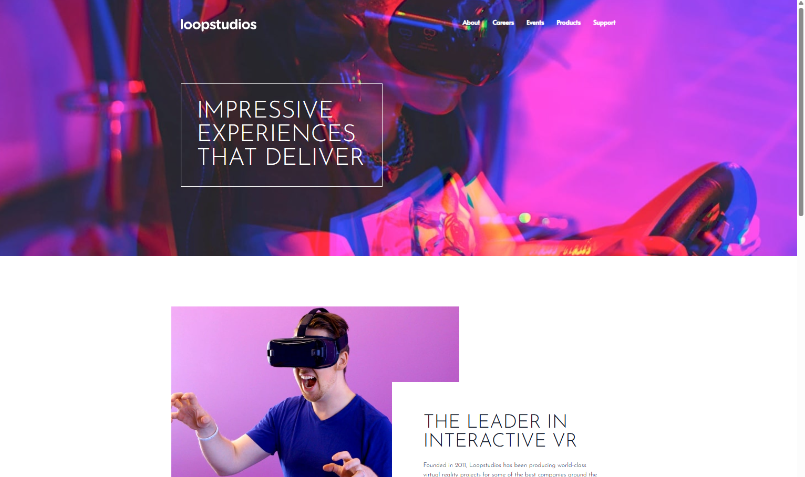

# 🎨 Tailwind CSS Projects

This repository contains a growing collection of projects built with **Tailwind CSS**.  
The goal is to practice the utility-first workflow while designing responsive, modern user interfaces.

---

## 🪴 Mini Projects
These small, hands-on projects focus on mastering Tailwind fundamentals,  including layout techniques, responsive design, and hover/transition effects.

### 1️⃣ Email Subscribe Card

A responsive email subscription component built with **Tailwind CSS**.

**Highlights**
- Mobile-first design with flexible layout (flex & responsive utilities)
- Smooth hover and transition effects
- Clean dark theme with a bright call-to-action button

📂 **Folder Path**  
`tailwind-projects/email-subscribe`

🖼 **Preview**  

  

---

### 2️⃣ Image Gallery

A responsive image gallery application built with **Tailwind CSS**.

**Highlights**
- Clean and minimal UI with a modern card layout
- Fully responsive grid (mobile to desktop)
- Hover effects revealing image details and bookmark icon
- Search bar and category menu with subtle hover animations

📂 **Folder Path**  
`tailwind-projects/image-gallery`

🖼 **Preview**  

  

---

### 3️⃣ Login Modal

A responsive login modal built with **Tailwind CSS**.

**Highlights**
- Clean, centered card layout with a split image panel
- Fully responsive design for mobile and desktop
- Smooth hover and transition effects on buttons
- Includes social login buttons (Facebook & Google)

📂 **Folder Path**  
`tailwind-projects/login-modal`

🖼 **Preview**  

  

---
### 4️⃣ Pricing Cards

A set of responsive pricing cards built with **Tailwind CSS**.

**Highlights**
- Clean dark theme with accent highlight on the featured plan
- Flexible, responsive layout (stack on mobile, row on desktop)
- Subtle shadows, borders, and hover transitions for interaction
- Semantic typography hierarchy for plan name, price, and features

📂 **Folder Path**  
`tailwind-projects/pricing-cards`

🖼 **Preview**  

  

---
### 5️⃣ Product Modal

A clean product detail / purchase card built with **Tailwind CSS**.

**Highlights**
- Split layout with product image and details
- Price block with crossed-out old price and bold sale price
- Primary CTA with pressed/raised button effect (border swap trick)
- Stock indicator with animated ping on hover
- Secondary actions: add to cart & add to wishlist

📂 **Folder Path**  
`tailwind-projects/product-modal`

🖼 **Preview**  

  

---
# 🌐 Website Projects

## 1) Clipboard – Landing Page

A clean landing page built with **Tailwind CSS v4**.

**Highlights**
- Responsive hero (desktop/mobile background image)
- Custom theme via `@theme` (breakpoints, colors, font)
- Reusable utilities with `@layer` (`.section-container`, `.button-container`, `h3` base)
- Features section (image + details), Access Anywhere, Supercharge cards
- References (logo strip) & Footer with social icon hover filter

**Tech**
- Tailwind CSS v4, Google Fonts (Bai Jamjuree), pure HTML

**📂 Folder Path**  
`website-projects/clipboard`

**🔗 Live Demo**  
[Clipboard-Project](https://shiny-toffee-ca1208.netlify.app)

**🖼️ Preview**

  
  

---

## 2) Loopstudios – Landing Page

A bold, modern landing page for a VR studio built with **Tailwind CSS**.

**Highlights**
- Fullscreen hero with an uppercase headline in a bordered box
- Desktop navbar with subtle underline-on-hover; mobile off-canvas menu with hamburger toggle
- Split “feature” section (image + text card) using layered/absolute positioning
- Responsive grid of 8 “creations” cards (desktop/mobile images) with gradient overlays and hover scale
- Reusable button styles and clean, typographic footer with social icons

**Tech**
- Tailwind CSS, Vanilla JS (menu toggle), Google Fonts (**Alata**, **Josefin Sans**), semantic HTML

**📂 Folder Path**  
`website-projects/loopstudios`

**🔗 Live Demo**  
[Loopstudios-Project](https://resplendent-sunburst-e7b9f0.netlify.app/#)

**🖼️ Preview**

  

---

## 3) Fylo – Landing Page

A clean, dark/light theme landing page built with **Tailwind CSS**.

**Highlights**
- **Dark/Light mode** with persistent toggle (localStorage + `prefers-color-scheme`)
- Hero with curved background + dynamic logo via CSS custom properties
- Four-card **Features** grid (icon, title, description)
- “**Stay productive**” split section (image + content with arrow link)
- Three-card **Testimonials** with quote mark and rounded avatars
- **Early Access** CTA with rounded input + button
- Semantic HTML (`nav`, `address`) and fully responsive layout

**Tech**
- Tailwind CSS v4, Vanilla JS (theme toggle)
- Google Fonts (**Open Sans**, **Raleway**)

**📂 Folder Path**  
`website-projects/fylo`

**🔗 Live Demo**  
[Fylo-Project](https://gleeful-pastelito-de63a6.netlify.app)

**🖼️ Preview**

  

---

## 4) Testimonial Grid

A responsive testimonial grid layout built with **Tailwind CSS**.

**Highlights**
- **CSS Grid** layout: 1-column mobile → 4 columns / 2 rows on desktop
- Feature card spans (e.g., wide hero card, tall sidebar card) with `col-span` / `row-span`
- Decorative **quote SVG** positioned absolutely above the hero card
- Avatar chips with rounded images and subtle rings
- Long copy handled with **line-clamp** utilities for tidy cards
- Mobile/desktop visibility tweaks (e.g., tall card hidden on small screens)
- Clean, accessible markup and consistent spacing/typography

**Tech**
- Tailwind CSS v4
- Google Font (**Barlow Semi Condensed**)
- Semantic HTML

**📂 Folder Path**  
`website-projects/testimonial-grid`

**🔗 Live Demo**  
[Testimonial-Grid](https://peppy-dasik-660ea4.netlify.app)

**🖼️ Preview**

  

---

## 5) Shortly – URL Shortening Landing Page

A crisp, conversion-focused landing page for a URL shortener built with **Tailwind CSS**.

**Highlights**
- Responsive **navbar** with desktop links and **mobile hamburger menu** (overlay panel)
- Hero section with illustration, bold headline, and primary CTA
- **Shorten form** (URL input, error message slot) + sample results with copy buttons
- “**Advanced Statistics**” intro and a three-card **Features** row
- Cyan **timeline line** (horizontal on desktop / vertical on mobile) using absolute positioning
- Full-width **CTA band** with centered message and button
- Accessible, semantic HTML and consistent hover/focus states

**Tech**
- Tailwind CSS v4, Vanilla JS (mobile menu & form interactions)
- Google Fonts (**Poppins**), semantic HTML

**📂 Folder Path**  
`website-projects/shortly`

**🔗 Live Demo**  
[Shortly-Project](https://strong-choux-266ebf.netlify.app)

**🖼️ Preview**

  

---

## 6) Bookmark – Landing Page

A polished, multi-section landing page with tabs and FAQ, built with **Tailwind CSS**.

**Highlights**
- Responsive **navbar** with desktop links and a **mobile hamburger** → full-screen overlay menu
- Hero with large illustration and decorative **soft-blue background shape** (absolute, rounded-full)
- **Tabbed features** (3 panels) with JS toggle via `data-target` and fixed panel height to avoid layout shift
- **Download cards** (Chrome/Firefox/Opera) with staggered offsets, dotted separators, and soft shadows
- **FAQ accordion** using a CSS-only approach (`group`, `focus-within`, `grid-rows-[0fr→1fr]`) for smooth expand/collapse
- **Newsletter CTA** with accessible form and a subtle **“shine”** animation on the submit button
- Thoughtful a11y touches: `aria-label`s for icons, `focus-visible` rings, semantic sections (`nav`, `section`, `footer`)
- Fully responsive, mobile-first spacing/typography; small hover/press **motion** (`hover:-translate-y-0.5`, `active:translate-y-0`)

**Tech**
- Tailwind CSS v4, Vanilla JS (mobile menu & tabs)
- Google Fonts (**Rubik**), semantic HTML

**📂 Folder Path**  
`website-projects/bookmark`

**🔗 Live Demo**  
[Bookmark-Project](https://sparkling-dolphin-3c5370.netlify.app)

**🖼️ Preview**

  

